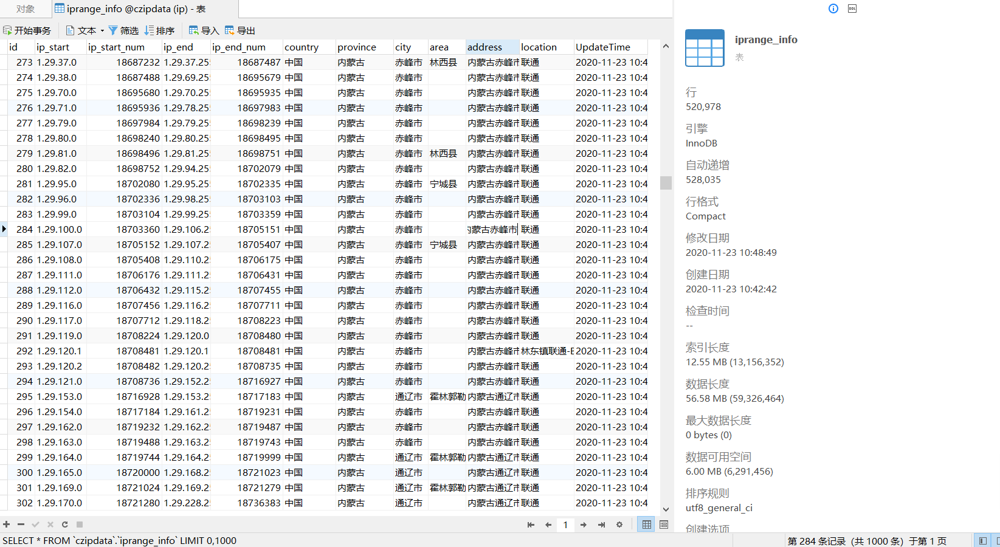
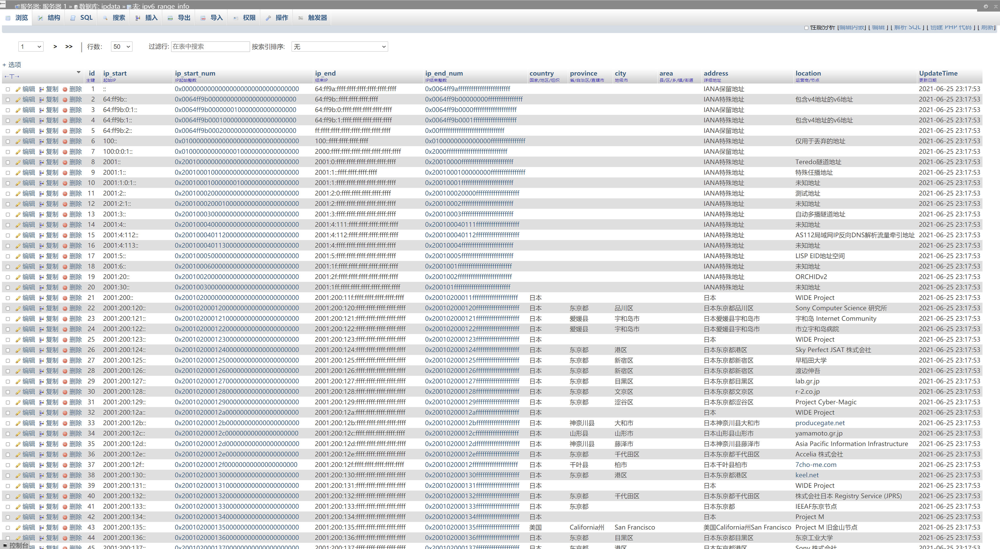
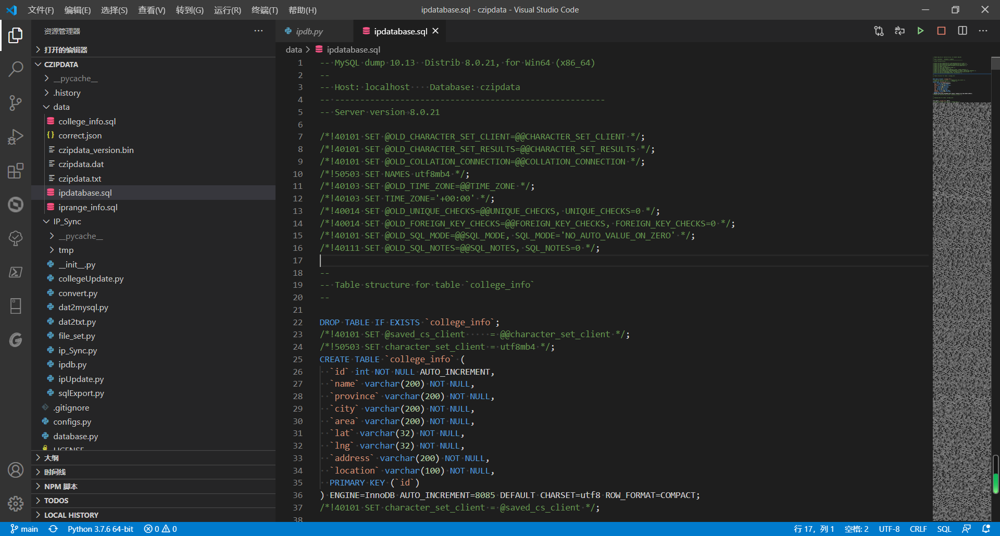
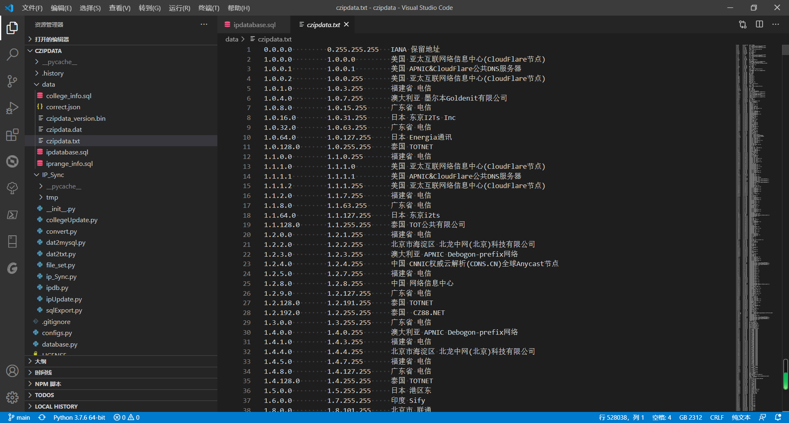
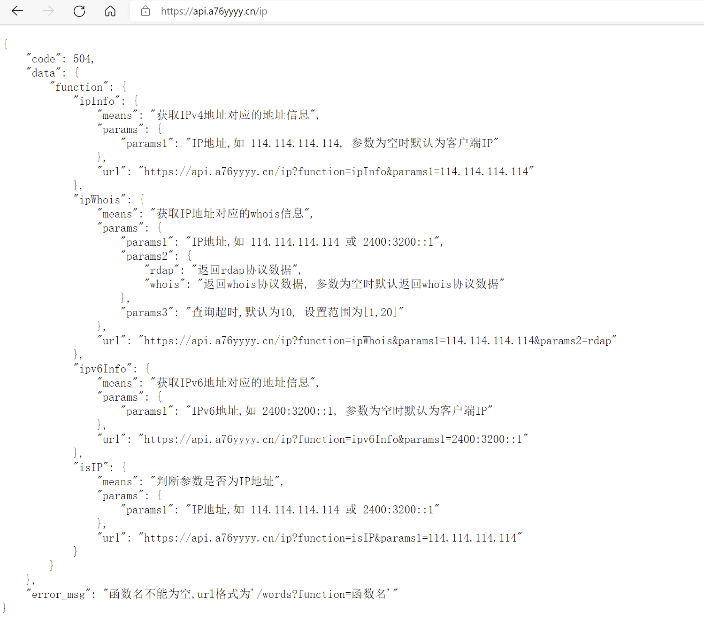
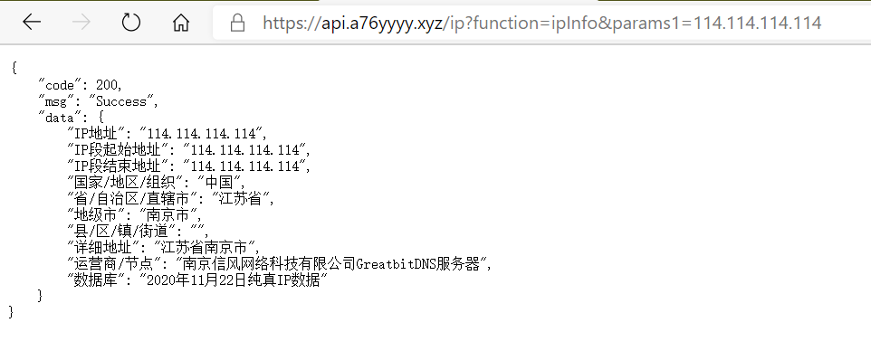
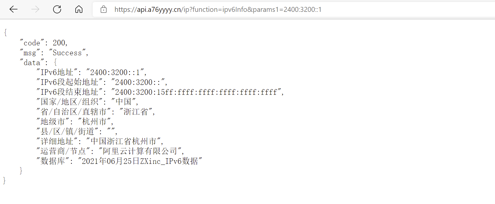

# IPDATA

 

 
 

纯真IPv4数据库镜像 / ZXinc_IPv6数据库镜像 & MySQL脚本/SQLite3 同步更新 for Python3(原czipdata项目)
(数据文件已通过release发布)

Github：[https://github.com/a76yyyy/ipdata](https://github.com/a76yyyy/ipdata)(推荐)

Gitee ：[https://gitee.com/a76yyyy/ipdata](https://gitee.com/a76yyyy/ipdata)(更新频率较低)

# 功能

1. 通过Python实现[纯真IPv4](https://update.cz88.net/)数据库及[ZXinc_ipv6](http://ip.zxinc.org/)数据库的镜像更新，数据库在data文件夹下;
2. 将数据文件解析为txt格式;
3. 将数据文件全量导入mysql中，请先安装mysql并启用服务;
4. 将数据文件全量导入SQLite3中，请先安装SQLite3并启用服务;
5. 将MySQL/SQLite3数据库中的IP数据库内的地址细分为省市区;
6. 生成sql脚本文件的gz压缩文档，请先安装 gzip 并添加至系统变量(默认提供gz压缩文档, 不提供sql脚本);
7. 生成SQLite3数据库db文件的gz压缩文档;
8. Windows使用BAT文件实现数据库的自动更新和推送;
9. 结合计划任务可实现windows的定时更新。

# 数据文件

文件 | 内容 | 类型
---|:---:|:---:
czipdata_version.bin|IPv4本地数据文件版本记录|Binary
ipv6data_version.bin|IPv6本地数据文件版本记录|Binary
ipdata.db|IP数据库db文件|SQLite3 DB文件
ipdatabase.sql|IP数据库sql脚本(含以下sql内容)|MySQL脚本
iprange_info.sql|纯真IPv4数据表sql脚本|MySQL脚本
ipv6_range_info.sql|ZXinc_IPv6数据表sql脚本|MySQL脚本
college_info.sql|高校信息表sql脚本|MySQL脚本
czipdata.dat|纯真IPv4数据文件|IPDB源文件
ipv6data.db|ZXinc_IPv6数据文件|IPDB源文件(Not SQLite3)
czipdata.txt|纯真IPv4数据文本文件|TXT
ipv6data.txt|ZXinc_IPv6数据文本文件|TXT
correct.json|地址细分纠错文件|JSON

# TODO

1. 实现data文件夹的分类存储;
2. 实现数据库的增量更新;
3. 实现Linux定时更新.

# 图片

# [API](https://api.a76yyyy.cn/ip)

示例IPv4 API接口(暂不提供源码):[https://api.a76yyyy.cn/ip?function=ipInfo&params1=114.114.114.114](https://api.a76yyyy.cn/ip?function=ipInfo&params1=114.114.114.114)

示例IPv6 API接口(暂不提供源码):[https://api.a76yyyy.cn/ip?function=ipv6Info&params1=2400:3200::1](https://api.a76yyyy.cn/ip?function=ipv6Info&params1=2400:3200::1)

## Stargazers over time

